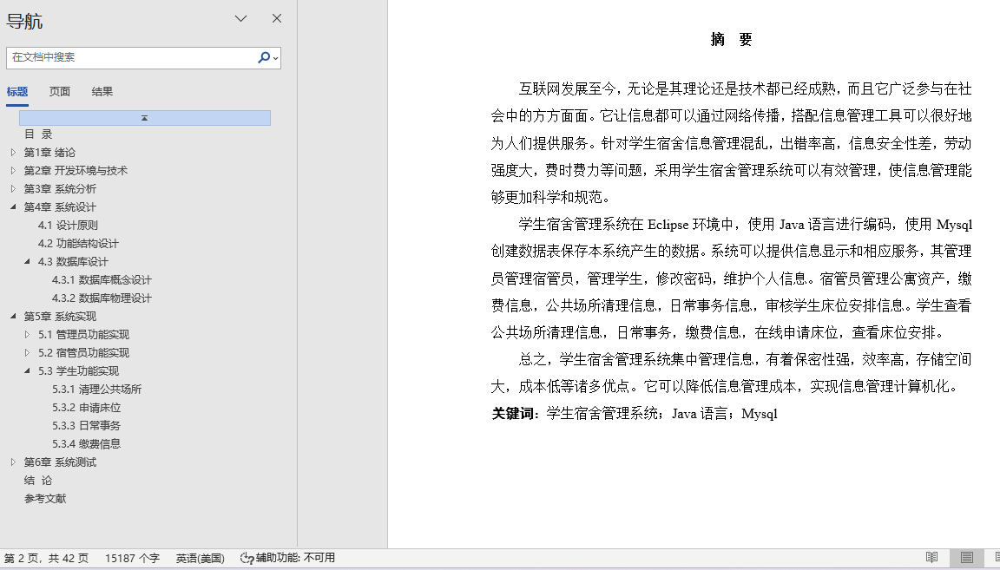
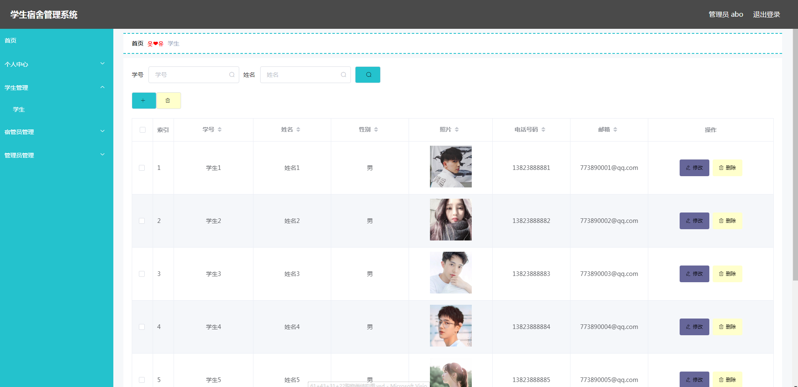
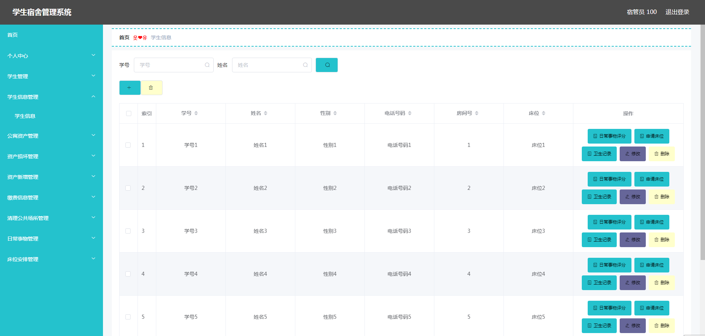
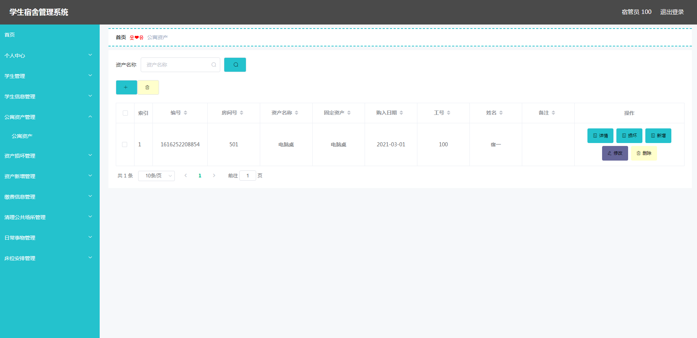
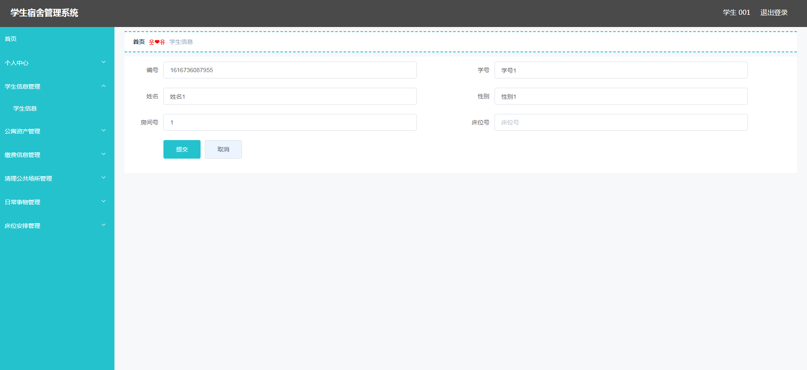
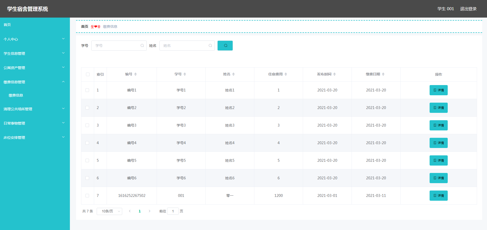
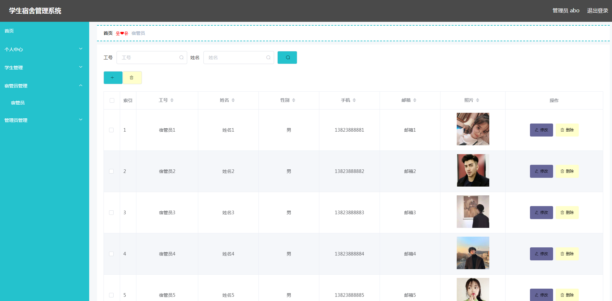

## 学生宿舍管理系统(程序+报告)

###  获取sql数据库文件: 从戎源码网 (https://armycodes.com/) QQ: 386869957 QQ群: 377586148
###  所有系统地址: (https://github.com/YuLin-Coder/AllProjectCatalog) 
###  所有项目以及源代码本人均调试运行无问题 可支持远程安装部署调试、定制修改、代码讲解

## 项目介绍
学生宿舍管理系统，系统包含两种角色：用户、管理员，系统分为前台和后台两大模块，主要功能如下：

1 管理员功能实现

宿管员管理 
管理员可以对宿管员的资料进行管理，包括新增、修改、删除等操作。

学生管理 
管理员可以对学生信息进行管理，包括增、删、改、查操作。

2宿管员功能实现

学生信息管理 
宿管员可以进行学生信息的增、删、改、查操作，管理学生的床位申请、卫生记录和日常事务评分。

公寓资产管理 
宿管员可以管理公寓资产，登记资产损坏信息。

缴费信息管理 
宿管员可以进行缴费信息的增、删、改操作。

床位安排管理 
宿管员可以审核学生的床位安排信息。

3  学生功能实现

清理公共场所 
学生可以查看自己负责清理的公共场所信息。

申请床位 
学生可以选择床位号进行床位申请，宿管员审核通过后，学生才能使用申请的床位。

日常事务 
学生可以查看日常事务的加分项和评分标准信息。

缴费信息 
学生可以查看住宿费用及缴费时间等信息。

## 项目技术
- 编程语言：Java
- 数据库：MySQL
- 项目管理工具：Maven
- 前端技术：HTML、CSS、JavaScript、Vue
- 后端技术：Spring、SpringMVC、MyBatis

## 运行环境
- JDK版本：JDK1.8及以上
- 开发工具：IDEA、Ecplise、Myecplise都可以
- 数据库: MySQL5.7及以上
- Maven：maven3.0及以上
- Node：14.14.0及以上

## 运行截图

